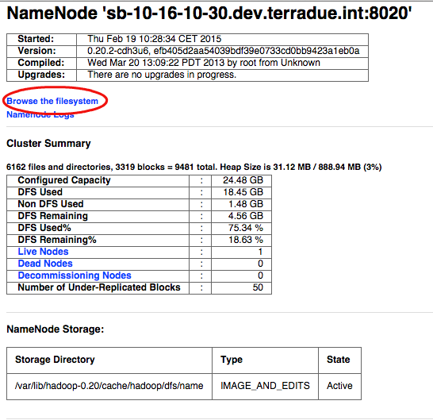
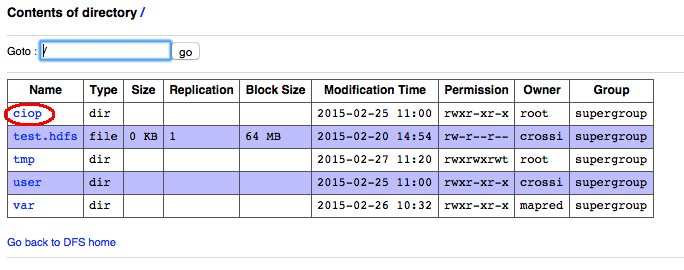
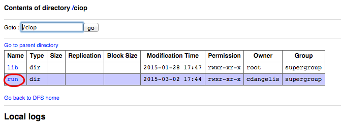
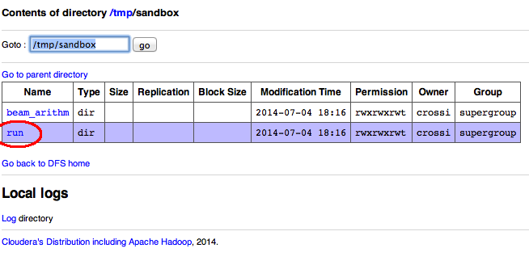
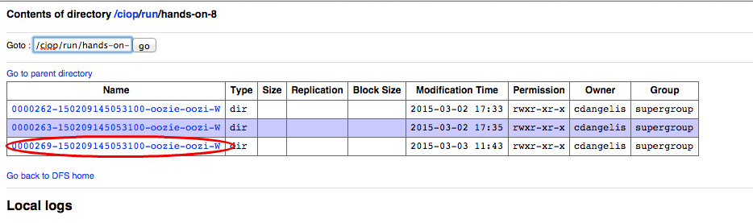
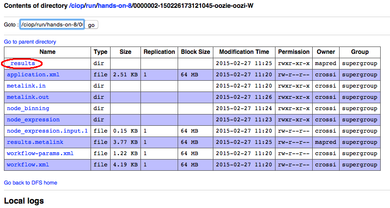

.. _browseresults:

Hands-On Exercise 8: browse published results
#############################################

In this exercise we will run again the workflow of the exercise :doc:`a multi-node workflow <multinode>`  and we will browse its results through the Web GUI.   

Run the workflow 
================

* Type the following command:

.. code-block:: console

  ciop-simwf

* Wait until the workflow is completed (it will take approximately five minutes).

Browse the results
==================

* Open a browser and type http://$HOSTNAME:50070 ,

.. tip::
     
  Read how to obtain the value of $HOSTNAME in the :doc:`General Notes <general_notes>` section

* Click on the link *Browse the filesystem*,

* Click on the link *tmp*,

* Click on the link *sandbox*,

* Click on the link *run*,

* Click on the link representing the workflow id (e.g. *0000000-140703150626955-oozie-oozi-W*),

* Click on the link *_result*,
  
* To see intermediate results, click on *node_expression* and then click on *data*. 

The following images show the steps that we have just performed:

.. figure:: includes/browseresults/gui7.png
   :scale: 80 %
   :alt: Browse results

Recap
=====

#. We executed a multinode workflow, 
#. We browsed either final or intermediate results through the Web GUI.

Files used in this Hands-On
===========================

Refer to files used in the exercise :doc:`a multi-node workflow <multinode>`
