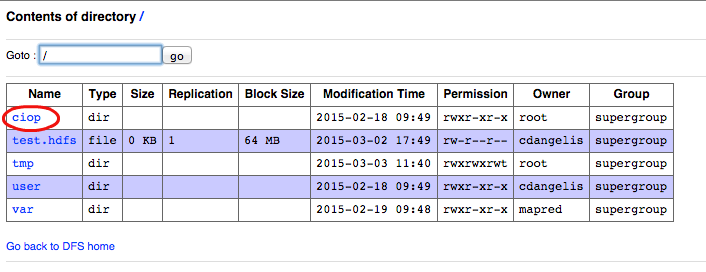
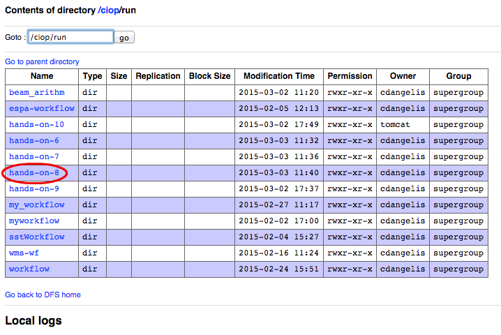
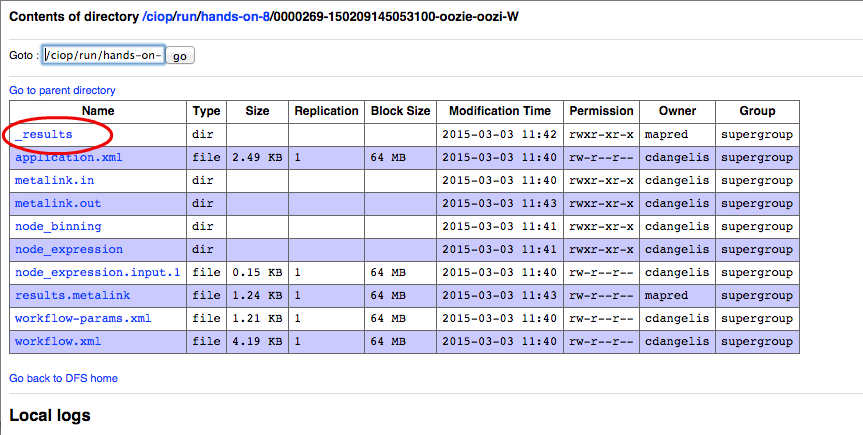
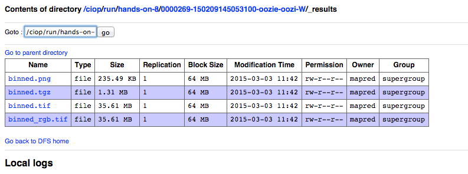

.. _multinode:

Hands-On Exercise 7: browse published results
#############################################

In this exercise we will run again the multinode workflow of the :doc:`Hands-On Exercise 6 <multinode>`  and we will broswe its results through the Web GUI.   

Run the workflow 
================

* Type the following command:

.. code-block:: console

  ciop-simwf

* Wait until the workflow is completed

Browse the results
==================

* Open a browser and type http://<sandbox_host>:50070 ,

.. tip::
  
  Read how to obtain the value of <sandbox_host> in the :doc:`Connect to your Sandbox <../start/sandbox>` section

* Click on the link *Browse the filesystem*,

* Click on the link *tmp*,

* Click on the link *sandbox*,

* Click on the link *run*,

* Click on the link representing the workflow id (e.g. *0000000-140703150626955-oozie-oozi-W*),

* Click on the link *_result*,
  
* To see intermediate results, click on *node_expression* and then click on *data*. 

The following image show the steps that we have just performed:

.. figure:: includes/browseresults/gui3.png
   :scale: 80 %
   :alt: Browse results

Recap
=====

* We executed a multinode workflow, 
* We browsed either final or intermediate results through the Web GUI.

Files used in this Hands-On
===========================

Refer to files used in the :doc:`Hands-On Exercise 6 <multinode>`
