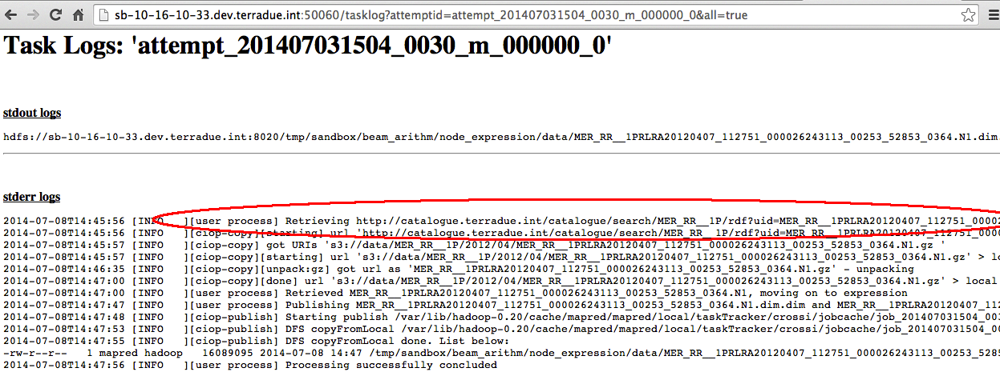

.. _catalogue:

Hands-On Exercise 9: using an OpenSearch catalogue
###################################################

In this exercise we will use an OpenSearch [#f1]_ catalogue URL as input source of the workflow, querying the catalogue with OpenSearch parameters.   

Prerequisite
=============

* You have cloned the Hands-On git repository (see :ref:`hands-on-repo`)

Install the Hands-On
====================

* Install the Hands-On Exercise 9, just typing:

.. code-block:: console

  cd
  cd dcs-hands-on
  mvn install -D hands.on=9 -P bash

Inspect the application.xml
===========================

* Inspect the *application.xml*, it is slightly different than the one of the exercise :doc:`a multi-node workflow <multinode>`:

.. container:: context-application-descriptor-file

  .. literalinclude:: src/dcs-hands-on/src/main/app-resources/hands-on-9/application.xml
       :language: xml
       :tab-width: 2

Note the different **source** in the *node_expression*:

.. container:: context-application-descriptor-file

  .. literalinclude:: src/dcs-hands-on/src/main/app-resources/hands-on-9/application.xml
       :language: xml
       :tab-width: 2
       :lines: 54-62

Note also the **OpenSearch parameters** defined in the jobTemplate *expression*:

.. container:: context-application-descriptor-file

  .. literalinclude:: src/dcs-hands-on/src/main/app-resources/hands-on-9/application.xml
       :language: xml
       :tab-width: 2
       :lines: 5-13

Run and debug the workflow
==========================

* Run the *node_expression*:

.. code-block:: console

  ciop-simjob node_expression

* Copy the Tracking URL and paste it in a browser,

* See the log of one of the two Tasks, as described in :doc:`make a robust workflow and debug it <debug>`. It will be similar to: 

Note that the input product is now downloaded from an external catalogue, as result of an OpenSearch query.

Recap
=====

#. We used an OpenSearch catalogue as source of the first node of the workflow,
#. We defined a number of OpenSearch parameters to query the catalogue, 
#. We processed the query results in the *node_expression*.

.. rubric:: Footnotes

.. [#f1] `OpenSearch <http://www.opensearch.org/>`_
