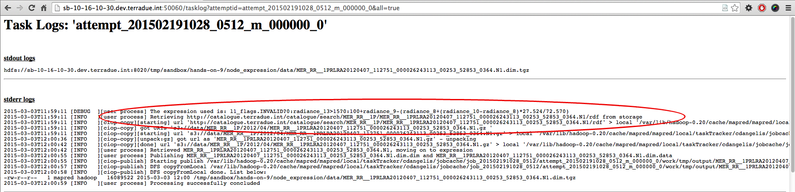

.. _catalogue:

Hands-On Exercise 9: using an OpenSearch catalogue
###################################################

In this exercise we will use an OpenSearch [#f1]_ catalogue URL as the input source of the workflow, 
and query the catalogue with OpenSearch parameters to get the input products.   

Prerequisites
=============

* You have cloned the Hands-On git repository (see :ref:`hands-on-repo`),
* *(Only for python)* You have installed the required software (see :ref:`python-reqs`),
* You have installed the BEAM Toolbox (see :ref:`toolbox-install`).

Install the Hands-On
====================

* Install the Hands-On Exercise 9, just type:

.. code-block:: console

  cd
  cd dcs-hands-on
  mvn clean install -D hands.on=9 -P bash

Inspect the application.xml
===========================

* Inspect the *application.xml*, it is slightly different than the one of the previous exercise :doc:`a multi-node workflow <multinode>`:

.. container:: context-application-descriptor-file

  .. literalinclude:: src/dcs-hands-on/src/main/app-resources/hands-on-9/application.xml
       :language: xml
       :tab-width: 2

Note the different **source** in the *node_expression*:

.. container:: context-application-descriptor-file

  .. literalinclude:: src/dcs-hands-on/src/main/app-resources/hands-on-9/application.xml
       :language: xml
       :tab-width: 2
       :lines: 55-62

The source is the URL of an **OpenSearch description document** of a **catalogue series**.
That XML document contains information on how to query products of a certain type (or series), i.e. URL templates and the parameter descriptions.

Note also the **OpenSearch parameters** (those with ``type="opensearch"`` and a ``target`` attribute) defined in the jobTemplate *expression*:

.. container:: context-application-descriptor-file

  .. literalinclude:: src/dcs-hands-on/src/main/app-resources/hands-on-9/application.xml
       :language: xml
       :tab-width: 2
       :lines: 5-13
       
       
       
Catalogue query
===============

This section is just an excursion intended to help understand how the products are retrieved using OpenSearch.

We saw the URL of the OpenSearch description document that contains URL templates for searching.
It contains a number of URL templates to obtain product metadata in different formats.

The URL template used for querying the products is this:

.. admonition:: URL template for product query

    \https://catalog.terradue.com:443//eo-samples/series/mer_rr__1p/search?format=atomeop&count={count?}&startPage={startPage?}&startIndex={startIndex?}&q={searchTerms?}&lang={language?}&update={dct:modified?}&do={t2:downloadOrigin?}&start=\ **{time:start?}**\ &stop=\ **{time:end?}**\ &trel={time:relation?}&bbox=\ **{geo:box?}**\ &uid={geo:uid?}&geom={geo:geometry?}&rel={geo:relation?}&cat={dc:subject?}&psn={eop:platform?}&isn={eop:instrument?}&st={eop:sensorType?}&pl={eop:processingLevel?}&ot={eop:orbitType?}&title={eop:title?}&pi={eop:parentIdentifier?}&od={eop:orbitDirection?}&lc={t2:landCover?}&dcg={t2:doubleCheckGeometry?}
  

The highlighted parts (``time:start``, ``time:end`` and ``geo:box``) are unique identifiers that refer to standardised search criteria;
in this case the temporal range (defined by start and end time) and the geographical area (the WGS 84 coordinates and the bottom-left or top-right bounding box) the desired products have to match (the question mark after the identifier means that the parameter is optional for the search).

The parameters in the ``<defaultParameters>`` section use these three identifiers as targets. This means, when the actual product query is done, the curly bracket portions are replaced with the text content of those XML elements or an empty string if there is none.
       
The replacement results in this query URL (shortened for readability):

.. admonition:: Resolved URL for query

   \https://catalog.terradue.com:443//eo-samples/series/mer_rr__1p/search?format=atomeop&start=\ **2012-04-06T10:24:29.000Z**\ &stop=\ **2012-04-07**\ &bbox=\ **2.99,58.45,0.53,58.26**

At that URL we find an ATOM XML document containing two entries (that correspond to 2 products). Within these entries, there are the download URLs of the actual product files.

The sandbox framework downloads the products and at this point we have the same products as in the previous exercice :ref:`multinode`.

Using OpenSearch makes the application more flexible since it can be used with search parameters so that different input data can be used without changing input file lists on the sandbox host.

Run and debug the workflow
==========================

* Run the *node_expression*:

.. code-block:: console

  ciop-run node_expression

* Copy the Tracking URL and paste it in a browser,

* Check the log of one of the two Tasks, as described in :doc:`make a robust workflow and debug it <debug>`. It will be similar to: 

Note that the input product is now downloaded from an external repository, resulting from the initial OpenSearch query to the catalogue, and from the way that catalogue references datasets.

Recap
=====

#. We used an OpenSearch catalogue as the source of the first node of the workflow;
#. We defined a number of OpenSearch parameters to query the catalogue; 
#. We processed the query results in the *node_expression*.
#. We learned that by using OpenSearch job parameters we can determine the input products.

.. rubric:: Footnotes

.. [#f1] `OpenSearch <http://www.opensearch.org/>`_
