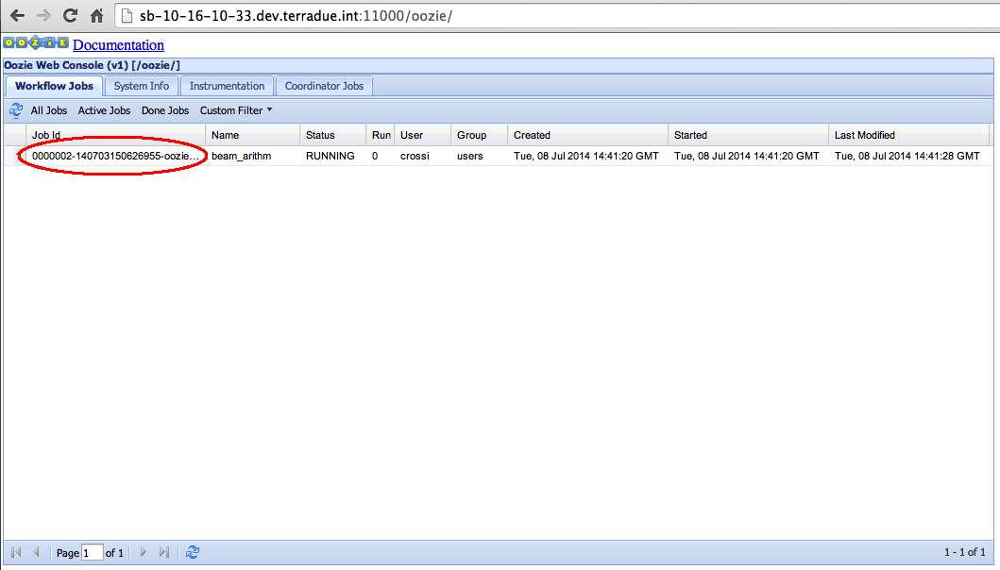
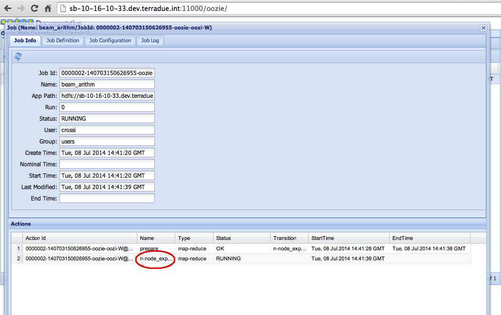
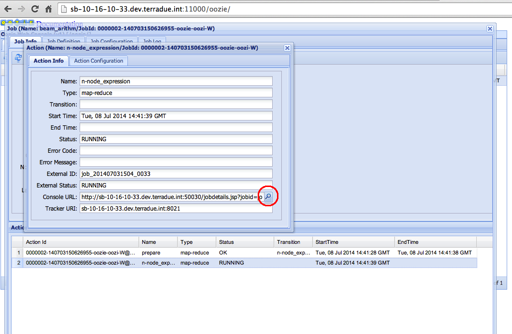
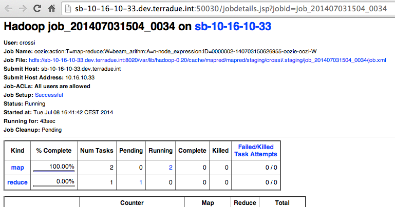

.. _debug-multinode:

Hands-On Exercise 7: debug a multi-node workflow
###############################################

In this exercise we will see how to debug the multi-node workflow described in the :doc:`Hands-On Exercise 6 <multinode>` using a specific Web GUI.   

Run the workflow 
================

* Type the following command:

.. code-block:: console

  ciop-simwf

* Press CTRL+C

.. warning::
  
  The workflow will continue its execution, despite to the CTRL+C input.
  
Debug the workflow
==================

* Open a browser and type http://$HOSTNAME:11000

  It will present the Oozie Web Console available on the Sandbox. It provides information about the status of the workflows and the access to their logs. 

.. tip::
  
  Read how to obtain the value of $HOSTNAME in the :doc:`General Notes <general_notes>` section

* Click on the *Job Id* value,

* Click on the *n-node_expression* value under the column *Name*,

* Click on the lens image,

* Continue debugging as described in :doc:`Hands-On Exercise 2 <debug>`. 

The following image show the steps that we have just performed:

Recap
=====

* We executed a multi-node workflow, 
* We used the Oozie Web Console to debug it.

Files used in this Hands-On
===========================

Refer to files used in the :doc:`Hands-On Exercise 6 <multinode>`
