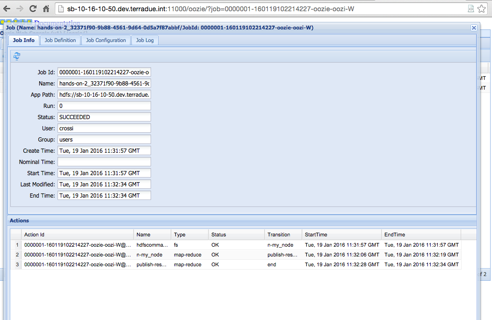
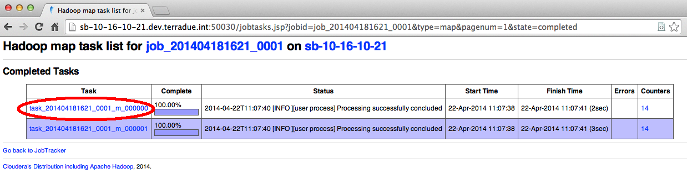
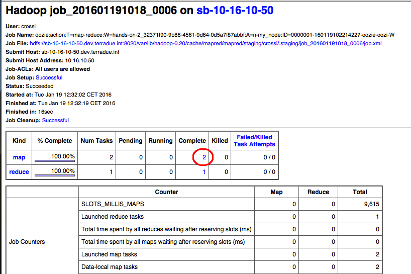
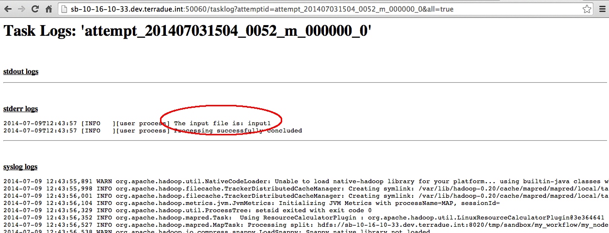

.. _debug:

Hands-On Exercise 2: make a robust workflow and debug it
########################################################

In this exercise we will install a more robust version of the basic workflow. Also we will learn how to debug the workflow through the Web GUI.

Install the Hands-On Exercise 2
===============================

To install the Hands-On, just type:

.. code-block:: console

  cd dcs-hands-on
  mvn install -D hands-on=2 -P bash

Inspect the run executable
==========================

* Open the *my_node/run* executable with a text editor or using the `more` command:

.. code-block:: console
 
 cd $_CIOP_APPLICATION_PATH
 more my_node/run

You will see the *cleanExit()* function. It will be useful to trace our workflow and make it more robust.

Run the node and debug the workflow
===================================

* Execute the node *my_node*:

.. code-block:: console

 ciop-simjob my_node

* From the output of the *ciop-simjob* command we can copy in the clipboard the **Tracking URL**. It will be similar to this:

.. code-block:: console-output

 14/07/09 12:43:53 INFO streaming.StreamJob: Tracking URL: http://sb-10-16-10-33.dev.terradue.int:50030/jobdetails.jsp?jobid=job_201407031504_0052 

* Open a browser and paste the Tracking URL just copied,

* You will see the job details in the Web GUI. The red rounded link represents the number of parallel tasks (in a Sandbox the default is 2). Click on this link:

    
* We have the list of tasks. 
* To see the details about of one of them, just click on the name in the **Task** column (the rounded one):

* Now we have the list of task attempts. 
* To see the output about of one of them (in this case we have just one attempt), just on the **All** link in the **Task Logs** column (the rounded one):

* Finally we have the output list of the selected task attempt. 
* We can see the output of the ciop-log function:

*Congrat !*
*You have  an Exit function to your run executable, and visualized the associated log message generated from the task completion*
*Here the related piece of code of the run executable:*

.. literalinclude:: src/dcs-hands-on/src/main/app-resources/hands-on-1/bash/my_node/run
   :language: bash
   :tab-width: 2
   :lines: 31-32

.. HINT::
 Try to debug the second task to see the output generated. 

Recap
=====

#. We added a group of variables representing our exit codes, the *cleanExit* function and finally we used the *$SUCCESS* exit code,
#. We ran the node expression and we debugged the output in the Web GUI.
