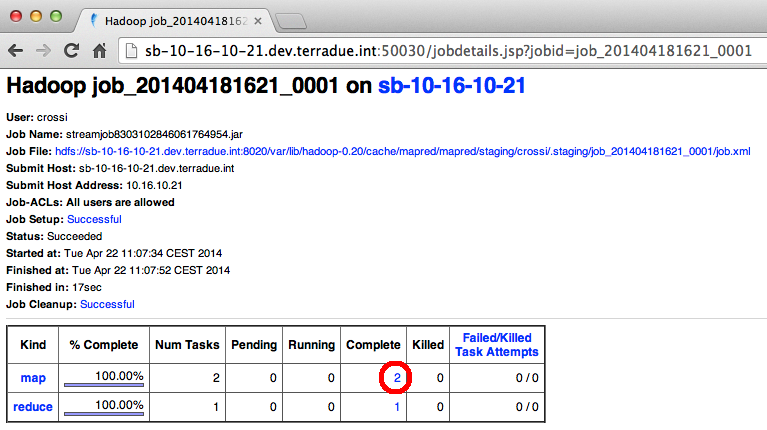
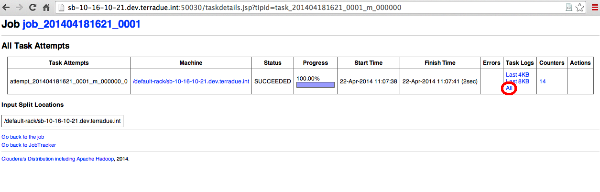
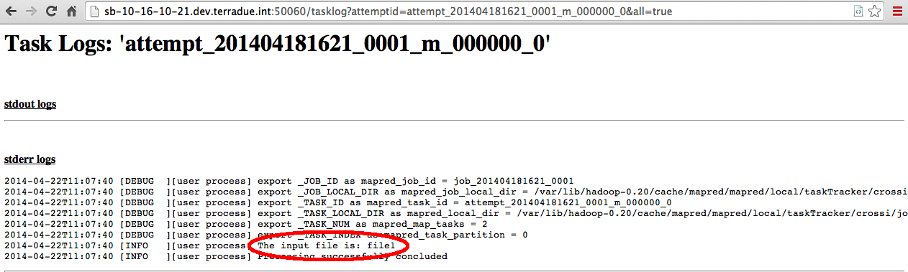

.. _debug:

Hands-On Exercise: make a robust workflow and debug it
######################################################

In this hands-on we will modify the basic workflow to make it more robust. Also we will debug the workflow through the Web GUI.

Modify the streaming executables
^^^^^^^^^^^^^^^^^^^^^^^^^^^^^^^^

* Open the *expression/run* executables with a text editor and modify it in the following way:
 
.. literalinclude:: src/debug/run
  :language: bash
  :tab-width: 2

We added the *cleanExit()* function. It will be useful to trace our workflow and make it more robust.

Run the node and debug the workflow
^^^^^^^^^^^^^^^^^^^^^^^^^^^^^^^^^^^

* Execute the node expression:

.. code-block:: bash

 $ ciop-simjob node_expression

* From the output of the *ciop-simjob* command we can copy in the clipboard the **Tracking URL**. It will be similar to this:

.. code-block:: none
 
 14/04/22 11:07:35 INFO streaming.StreamJob: Tracking URL: http://sb-10-16-10-21.dev.terradue.int:50030/jobdetails.jsp?jobid=job_201404181621_0001

* Open a browser and paste the Tracking URL just copied,

* You will see the job details in the Web GUI. The red rounded link represents the number of parallel tasks (in a Sandbox the default is 2). Click on this link:

    
* We have the list of tasks. To see the details about of one of them, just click on the name in the **Task** column (the rounded one):

* Now we have the list of task attempts. To see the output about of one of them (in this case we have just one attempt), just on the **All** link in the **Task Logs** column (the rounded one):

* Finally we have the output list of the selected task attempt. We can see the output of the ciop-log function:

*Here the related piece of code of the expression/run executable:*

.. literalinclude:: src/debug/run
   :language: bash
   :tab-width: 2
   :lines: 31-32

.. HINT::
 Try to debug the second task to see the output generated. 

What we done
^^^^^^^^^^^^

#. We added a group of variables representing our exit codes, the *cleanExit* function and finally we used the *$SUCCESS* exit code,
#. We ran the node expression and we debugged the output in the Web GUI.
