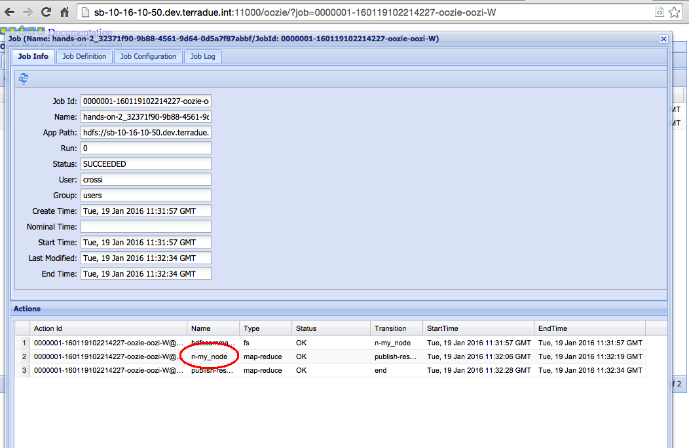
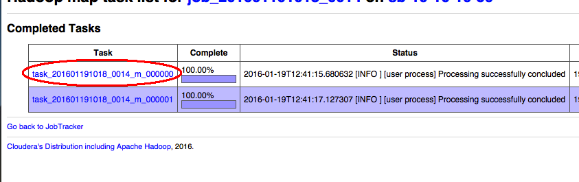
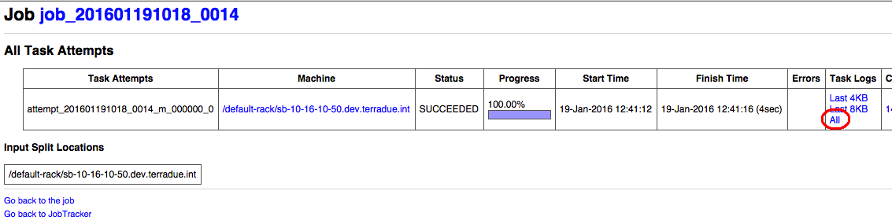

.. _debug:

Hands-On Exercise 2: make a robust workflow and debug it
########################################################

In this exercise we will install a more robust version of the basic workflow. Also we will learn how to debug the workflow through the Hadoop JobTracker Web GUI.

Prerequisite
=============

* You have cloned the Hands-On git repository (see :ref:`hands-on-repo`).

Install the Hands-On
=====================

* Install the Hands-On Exercise 2, just type:

.. code-block:: console

  cd
  cd dcs-hands-on
  mvn clean install -D hands.on=2 -P bash

Inspect the run executable
==========================

* Open the *my_node/run* executable with a text editor or using the *more* command:

.. code-block:: console
 
 cd $_CIOP_APPLICATION_PATH
 more my_node/run

You will see the *cleanExit()* function. It will be useful to trace our workflow and make it more robust.

Run the node and debug the workflow
===================================

* Execute the node *my_node*:

.. code-block:: console

 ciop-run my_node

* From the output of the *ciop-run* command, we can copy in the clipboard the **Tracking URL**. It will be similar to this:

.. code-block:: console-output

 2016-01-19 12:31:57 [INFO ] - Tracking URL:
 2016-01-19 12:31:57 [INFO ] - http://sb-10-16-10-50.dev.terradue.int:11000/oozie/?job=0000001-160119102214227-oozie-oozi-W

* Open a browser and paste the Tracking URL just copied.

* You will see the workflow details in the Web GUI. On the screenshot, the red rounded field represents the node my_node. Click on this field and then in the lens icon:

   
.. figure:: includes/debug/gui2.png
   :scale: 70 %
   :alt: Node detail

* You will see the job details in the Web GUI. On the screenshot, the red rounded link represents the number of parallel tasks (in Sandbox mode, the default is 2). Click on this link:

.. figure:: includes/debug/gui3.png
   :scale: 70 %
   :alt: Job summary
    
* We have the list of tasks. 
* To see the details about of one of them, just click on the name in the **Task** column (the rounded one):

* Now we have the list of task attempts. 
* To see the output related to one of them (in this case we have just one attempt), just click on the **All** link in the **Task Logs** column (the rounded one):

* Finally we have the output list of the selected task attempt. 
* We can see the output of the ciop-log function:

.. admonition:: Congrats

  You learnt how to insert an Exit function in your run executable, and to visualize the associated log message generated from the task completion.
  
Here is the related piece of code of the run executable:*

.. literalinclude:: src/dcs-hands-on/src/main/app-resources/hands-on-2/bash/my_node/run
   :language: bash
   :tab-width: 2
   :lines: 30

.. HINT::
 Try to debug the second task to see the output generated. 

Recap
=====

#. We installed a different version of the run executable that includes some additional features to make it more robust;
#. We ran the node 'expression' and we debugged the output in the Hadoop JobTracker Web GUI.
