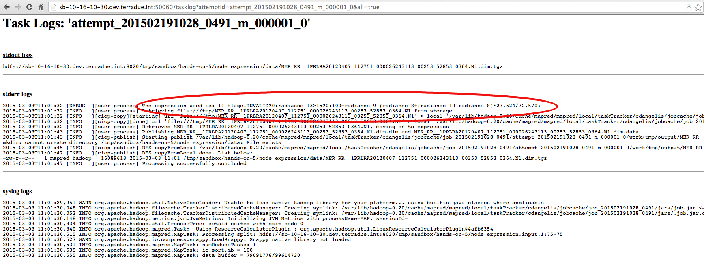

.. _parameters:

Hands-On Exercise 5: using parameters
#####################################

In this exercise we will see the usage of parameters in the workflow.   

Prepare the application.xml
===========================

Modify the application.xml in this way:

.. literalinclude:: src/parameters/application.xml
     :language: xml
     :tab-width: 2

Modify the run executable
===========================

* Open the file *expression/run* and substitute the line:

.. literalinclude:: src/toolbox/expression/run
      :language: bash
      :tab-width: 2
      :lines: 39

with:

.. literalinclude:: src/parameters/expression/run
      :language: bash
      :tab-width: 2
      :lines: 39-43

Run and debug the workflow
==========================

* Run the node *node_expression*:

.. code-block:: console

  ciop-simjob node_expression

* Check the output of the application by copying the Tracking URL from the *ciop-simjob* command and paste it in a browser (see :doc:`Hands-On Exercise 2 <debug>`). You will see an output similar to:

Recap
=====

#. We added a parameter in the node of our workflow,
#. We used the value of that parameter in our run executable.

Files used in this Hands-On
===========================

* :download:`application.xml <src/parameters/application.xml>`
* :download:`inputs/list <src/stagedata/list>`
* :download:`expression/run <src/parameters/expression/run>`
