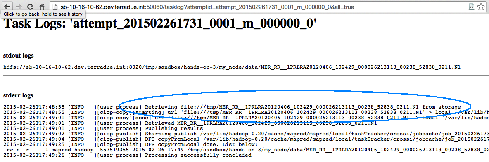

.. _stagedata:

Hands-On Exercise 3: staging data
#################################

In this exercise we will prepare input data for our workflow (this process is named *Stage In*), and we will publish out data as result of the workflow (this process is named *Stage Out*).   

Prerequisites
=============

* You have cloned the Hands-On git repository (see :ref:`hands-on-repo`),
* *(Only for python)* You have installed the required software (see :ref:`python-reqs`).

Install the Hands-On
=====================

* Install the Hands-On Exercise 3, just typing:

.. code-block:: console

  cd
  cd dcs-hands-on
  mvn clean install -D hands.on=3 -P bash

Inspect the application.xml
===========================

The application.xml is similar to the one used in the first hands-on exercise :doc:`a basic workflow <basic>`:

.. container:: context-application-descriptor-file

  .. literalinclude:: src/dcs-hands-on/src/main/app-resources/hands-on-3/application.xml
    :language: xml
    :tab-width: 2

Download data from a remote server
==================================

We need a local copy of the data to be ingested by a run executable. 
We can use the *ciop-copy* tool to interact with a remote catalogue, retrieve a data source (download link) from its catalogue reference, and download the data locally.

* Type the following commands: 

.. code-block:: console

  cd /tmp
  opensearch-client https://catalog.terradue.com/eo-samples/series/mer_rr__1p/search?uid=MER_RR__1PRLRA20120407_112751_000026243113_00253_52853_0364 enclosure | ciop-copy -o /tmp -
  opensearch-client https://catalog.terradue.com/eo-samples/series/mer_rr__1p/search?uid=MER_RR__1PRLRA20120406_102429_000026213113_00238_52838_0211 enclosure | ciop-copy -o /tmp -  
  ls -l | grep MER_RR

The output of the *ls -l* command will be similar to:

.. code-block:: console-output
    
 total 1091164
 -rw-r--r-- 1 crossi ciop 558118134 Apr 24 17:41 MER_RR__1PRLRA20120406_102429_000026213113_00238_52838_0211.N1
 -rw-r--r-- 1 crossi ciop 558118134 Apr 24 17:35 MER_RR__1PRLRA20120407_112751_000026243113_00253_52853_0364.N1

Inspect the inputs file
=======================

* Open the file */application/inputs/list* and check the following lines:

.. literalinclude:: src/dcs-hands-on/src/main/app-resources/hands-on-3/inputs/list
     :language: none

These lines define the input data to be ingested by a run executable.

.. WARNING::
   The file *inputs/list* should contain only these two lines (without blank lines or comments).

Publish the data
================

* Inspect the file *my_node/run* using for example the *more* command:

.. code-block:: console
  
  cd $_CIOP_APPLICATION_PATH
  more my_node/run
  
Several programming or scripting languages are supported to implement the run executable. In the above example we used *bash*.  

* Note the *ciop-publish* command:

.. container:: context-run-executable

  .. literalinclude:: src/dcs-hands-on/src/main/app-resources/hands-on-3/bash/my_node/run
     :language: bash
     :tab-width: 2
     :lines: 50

.. NOTE::
     The command *ciop-publish* will put the workflow's stage out data on the HDFS (the underlying Hadoop Distributed File System), and it will pass it to the Hadoop framework by reference.  

Run and debug the workflow
==========================

* Run the node *my_node*:

.. code-block:: console

  ciop-run my_node

The output will be similar to:

.. code-block:: console-output

  2016-01-19 12:54:32 [WARN ] -  -- WPS needs at least one input value from your application.xml (source or parameter with scope=runtime);
  2016-01-19 12:54:33 [INFO ] - Workflow submitted
  2016-01-19 12:54:33 [INFO ] - Closing this program will not stop the job.
  2016-01-19 12:54:33 [INFO ] - To kill this job type:
  2016-01-19 12:54:33 [INFO ] - ciop-stop 0000005-160119102214227-oozie-oozi-W
  2016-01-19 12:54:33 [INFO ] - Tracking URL:
  2016-01-19 12:54:33 [INFO ] - http://sb-10-16-10-50.dev.terradue.int:11000/oozie/?job=0000005-160119102214227-oozie-oozi-W

  Node Name     :  my_node
  Status        :  OK

  Publishing results...

  2016-01-19 12:56:12 [INFO ] - Workflow completed.

* Check the output of the application by copying the Tracking URL from the *ciop-run* command, and paste it in a browser (see :doc:`make a robust workflow and debug it <debug>`). You will see an output similar to:

Recap
=====

#. We downloaded and prepared data from a remote catalogue;
#. We used it in our workflow (*Stage In*);
#. We published the workflow results to pass the Stage out data by reference to the Hadoop framework
