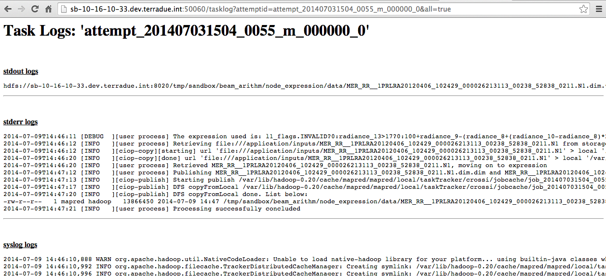

.. _toolbox:

Hands-On Exercise 4: using a custom toolbox
#############################################

In this exercise we will use a custom toolbox to process the inputs of our workflow and we will publish its results on HDFS.   

Install the ESA BEAM Toolbox
============================

The ESA BEAM (Basic ERS & Envisat (A) ATSR and Meris) Toolbox [#f1]_ is an open-source toolbox and development platform for viewing, analyzing and processing of remote sensing raster data. To install it type:

.. code-block:: console

  sudo yum install esa-beam-4.11

Prepare the application.xml
===========================

.. classes:: ciccio

dkjd ksjdhf 

.. class:: ciccio

ciao ciao

  .. code-block:: bash

    this is a test
    ok
    ok

Modify the application.xml in this way:

.. literalinclude:: src/toolbox/application.xml
     :language: xml
     :tab-width: 2

Prepare the streaming executable
================================

* The ESA BEAM Toolbox has to be called in the streaming executable. First of all, we have to prepare the new executable:   

.. code-block:: console

  cd $_CIOP_APPLICATION_PATH
  mkdir expression
  touch expression/run
  chmod +x expression/run

.. NOTE::
        If you prefer, you can delete the previous my_node/run streaming executable since it will not be used anymore.

* Open the file *expression/run* and paste the following code:

.. literalinclude:: src/toolbox/expression/run
      :language: bash
      :tab-width: 2

The ESA BEAM Toolbox is called in:

.. literalinclude:: src/toolbox/expression/run
      :language: bash
      :tab-width: 2
      :lines: 105

For further explaination see "Bulk Processing with GPT" [#f2]_ and "Creating a GPF Graph" [#f3]_.

Run and debug the workflow
==========================

* Run the node *node_expression*:

.. code-block:: console

  ciop-simjob node_expression

* Check the output of the application by copying the Tracking URL from the *ciop-simjob* command and paste it in a browser (see :doc:`Hands-On Exercise 2 <debug>`). You will see an output similar to:

Recap
=====

#. We installed the custom toolbox ESA BEAM,
#. We included it in a streaming executable,
#. We processed the inputs with the BandMaths Operator provided by the ESA BEAM Toolbox,
#. We published the results in HDFS.

Files used in this Hands-On
===========================

* :download:`application.xml <src/toolbox/application.xml>`
* :download:`inputs/list <src/stagedata/list>`
* :download:`expression/run <src/toolbox/expression/run>`

.. rubric:: Footnotes

.. [#f1] `ESA BEAM Toolbox BandMaths <http://www.brockmann-consult.de/beam/doc/help/gpf/org_esa_beam_gpf_operators_standard_BandMathsOp.html>`_
.. [#f2] `Bulk Processing with GPT <http://www.brockmann-consult.de/beam-wiki/display/BEAM/Bulk+Processing+with+GPT>`_
.. [#f3] `Creating a GPF Graph <http://www.brockmann-consult.de/beam-wiki/display/BEAM/Creating+a+GPF+Graph>`_
