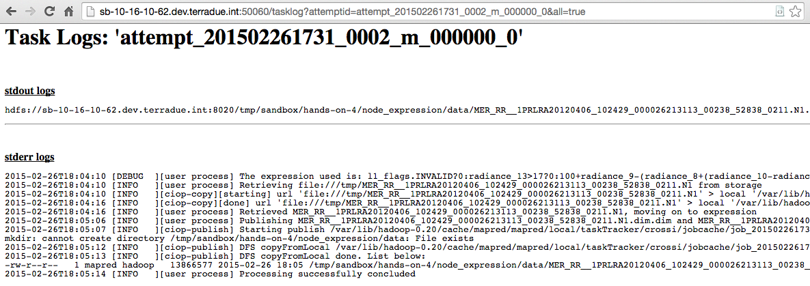

.. _toolbox:

Hands-On Exercise 4: using a toolbox
#####################################

In this exercise we will use a toolbox to process the inputs of our workflow and we will publish its results on HDFS.   

Prerequisite
=============

* You have cloned the Hands-On git repository (see :ref:`hands-on-repo`)

Install the Hands-On Exercise 4
===============================

To install the Hands-On exercise 4, just type:

.. code-block:: console

  cd dcs-hands-on
  mvn install -D hands.on=4 -P bash

Install the ESA BEAM Toolbox
============================

The ESA BEAM (Basic ERS & Envisat (A) ATSR and Meris) Toolbox [#f1]_ is an open-source toolbox and development platform for viewing, analyzing and processing of remote sensing raster data. To install it type:

.. code-block:: console

  sudo yum install -y esa-beam-4.11

Inspect the application.xml
===========================

Inspect the *application.xml*, it looks slightly different:

.. container:: context-application-descriptor-file

  .. literalinclude:: src/dcs-hands-on/src/main/app-resources/hands-on-4/application.xml
       :language: xml
       :tab-width: 2

Inspect the run executable
===========================

* The ESA BEAM Toolbox has to be called in the run executable. We can inspect the run executable and see when and how the ESA BEAM Toolbox is used: 

.. code-block:: console

  cd $_CIOP_APPLICATION_PATH
  more expression/run

.. HINT::
  The ESA BEAM Toolbox is executed through the *gpt.sh* script

For further explaination see "Bulk Processing with GPT" [#f2]_ and "Creating a GPF Graph" [#f3]_.

Run and debug the workflow
==========================

* Run the node *node_expression*:

.. code-block:: console

  ciop-simjob node_expression

* Check the output of the application by copying the Tracking URL from the *ciop-simjob* command and paste it in a browser (see :doc:`make a robust workflow and debug it <debug>`). You will see an output similar to:

Recap
=====

#. We installed the custom toolbox ESA BEAM,
#. We included it in a run executable,
#. We processed the inputs with the BandMaths Operator provided by the ESA BEAM Toolbox,
#. We published the results in HDFS.

.. rubric:: Footnotes

.. [#f1] `ESA BEAM Toolbox BandMaths <http://www.brockmann-consult.de/beam/doc/help/gpf/org_esa_beam_gpf_operators_standard_BandMathsOp.html>`_
.. [#f2] `Bulk Processing with GPT <http://www.brockmann-consult.de/beam-wiki/display/BEAM/Bulk+Processing+with+GPT>`_
.. [#f3] `Creating a GPF Graph <http://www.brockmann-consult.de/beam-wiki/display/BEAM/Creating+a+GPF+Graph>`_
