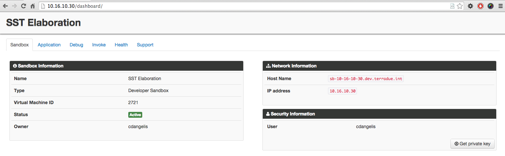
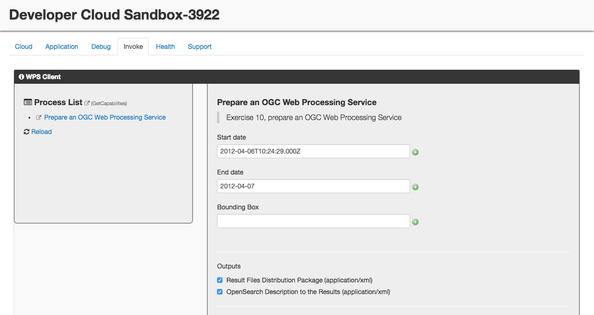
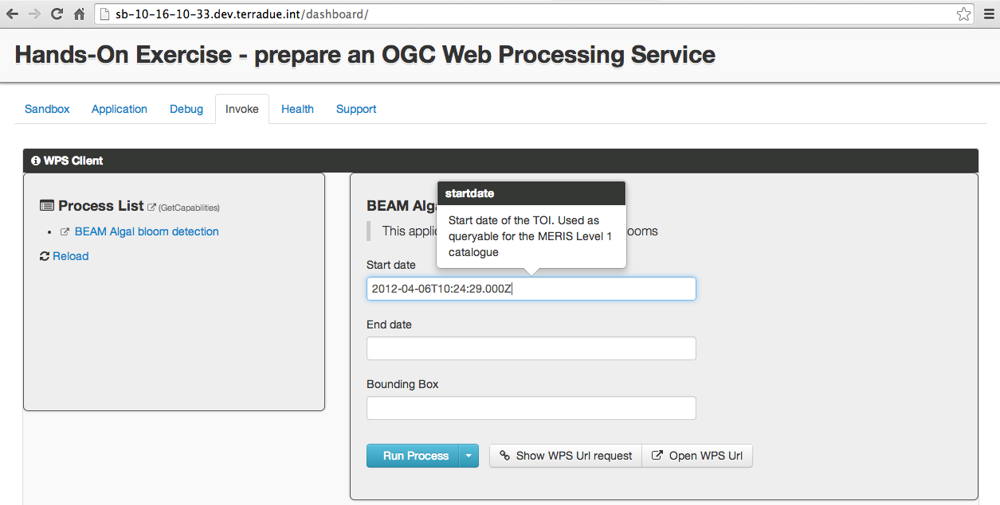
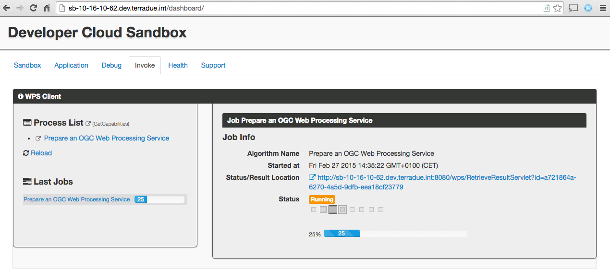
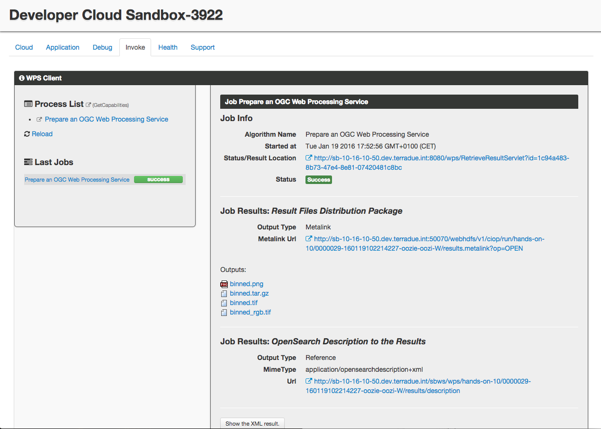
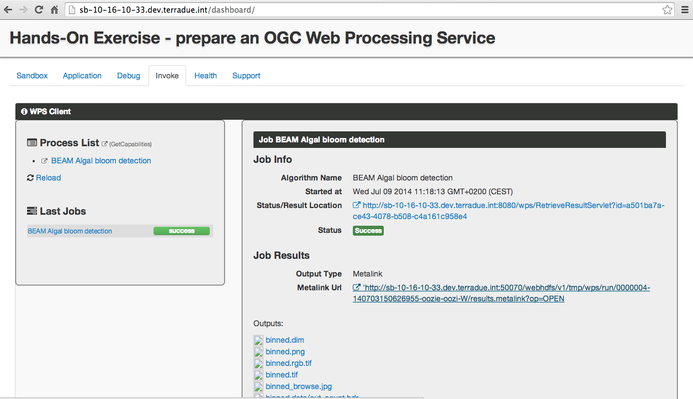

.. _wps:

Hands-On Exercise 10: prepare an OGC Web Processing Service
###########################################################

In this exercise we will prepare our workflow to expose an OGC Web Processing Service (WPS) [#f1]_ and we will trigger it through a WPS Client.

Prerequisite
=============

* You have cloned the Hands-On git repository (see :ref:`hands-on-repo`)

Install the Hands-On
====================

* Install the Hands-On Exercise 10, just typing:

.. code-block:: console

  cd
  cd dcs-hands-on
  mvn install -D hands.on=10 -P bash

Inspect the application.xml
===========================

* Inspect the *application.xml*:

.. container:: context-application-descriptor-file

  .. literalinclude:: src/dcs-hands-on/src/main/app-resources/hands-on-10/application.xml
       :language: xml
       :tab-width: 2

We added informational attributes for the WPS to the *<workflow>* tag:

.. container:: context-application-descriptor-file

  .. literalinclude:: src/dcs-hands-on/src/main/app-resources/hands-on-10/application.xml
       :language: xml
       :tab-width: 2
       :lines: 53

And we added informational attributes to the *<parameter>* tags to be exposed through the WPS. Note the *scope="runtime"* attribute:

.. container:: context-application-descriptor-file

  .. literalinclude:: src/dcs-hands-on/src/main/app-resources/hands-on-10/application.xml
       :language: xml
       :tab-width: 2
       :lines: 5-13

Trigger the WPS service
========================

* Open a browser and type http://$HOSTNAME/dashboard

* Click on the tab *Invoke*,

* Click on the link *BEAM Algal bloom detection* under **Process List**,

* Type in the field *Start date* the value *2012-04-06T10:24:29.000Z*,

* Type in the field *End date* the value *2012-04-07*,

* Type in the field *Bounding Box* the value *2.99,58.45,0.53,58.26*,

* Click on the button *Run Process*,

* Follow the execution until it ends (more or less five minutes).
 
The following images show the steps that we have just performed:

Recap
=====

#. We prepared an *application.xml* suitable for the OGC WPS,
#. We triggered the service through the WPS Client included in the Sandbox Dashboard.

.. rubric:: Footnotes

.. [#f1] `OGC Web Processing Service <http://www.opengeospatial.org/standards/wps>`_
