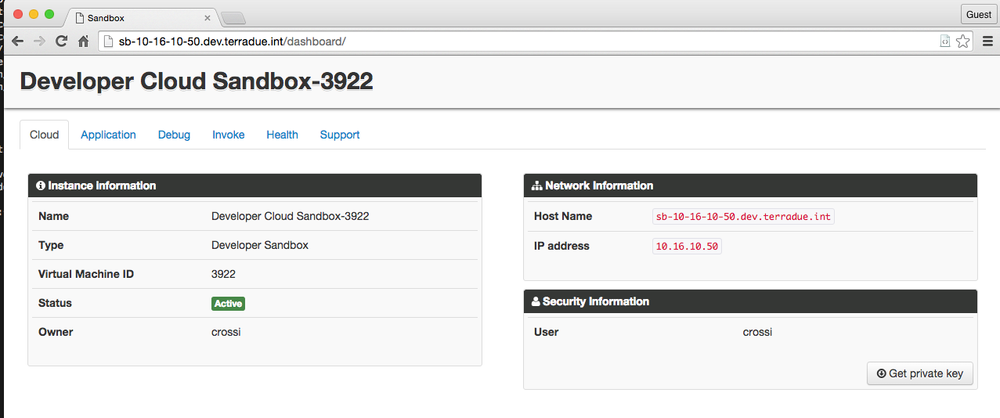
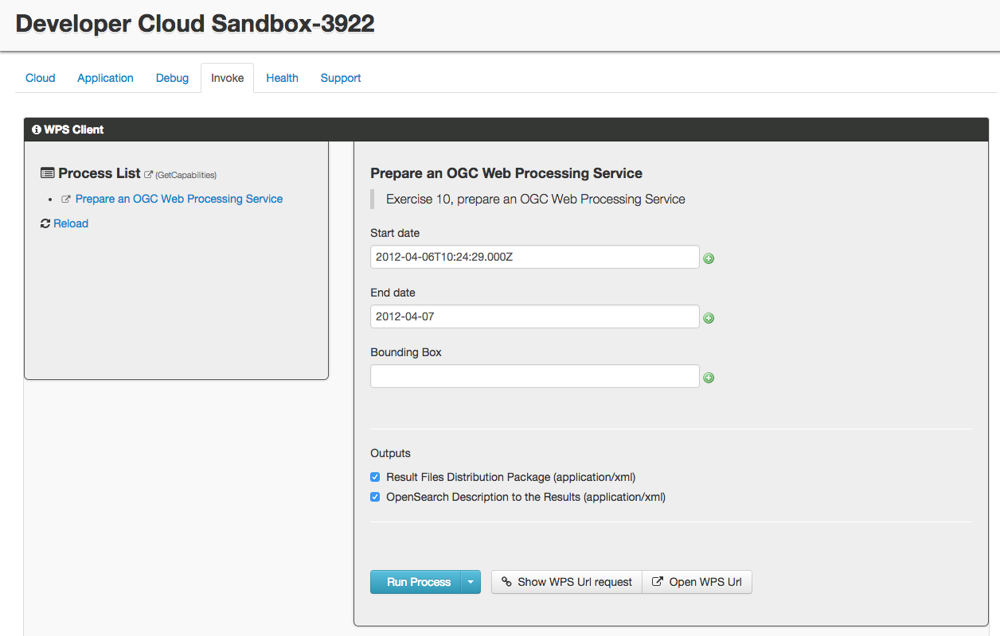
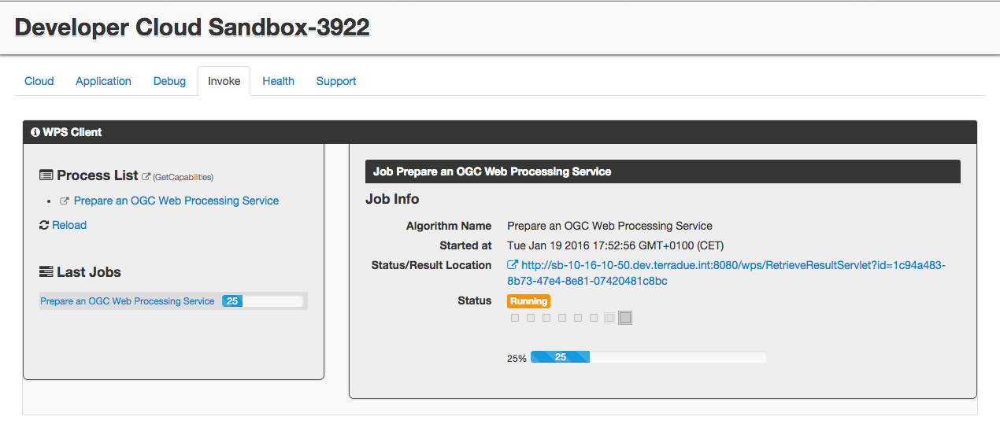

.. _wps:

Hands-On Exercise 10: prepare an OGC Web Processing Service
###########################################################

In this exercise we will prepare our workflow to expose an OGC Web Processing Service (WPS) [#f1]_ and we will trigger it through a WPS Client.

Prepare the application.xml
===========================

* Modify the *application.xml* in this way:

.. container:: context-application-descriptor-file

  .. literalinclude:: src/wps/application.xml
       :language: xml
       :tab-width: 2

We added informational attributes for the WPS to the *<workflow>* tag:

.. container:: context-application-descriptor-file

  .. literalinclude:: src/wps/application.xml
       :language: xml
       :tab-width: 2
       :lines: 53

And we added informational attributes to the *<parameter>* tags to be exposed through the WPS. Note the *scope="runtime"* attribute:

.. container:: context-application-descriptor-file

  .. literalinclude:: src/wps/application.xml
       :language: xml
       :tab-width: 2
       :lines: 5-13

Trigger the WPS service
========================

* Open a browser and type http://$HOSTNAME/dashboard

* Click on the tab *Invoke*,

* Click on the link *BEAM Algal bloom detection* under **Process List**,

* Type in the field *Start date* the value *2012-04-06T10:24:29.000Z*,

* Type in the field *End date* the value *2012-04-07*,

* Type in the field *Bounding Box* the value *2.99,58.45,0.53,58.26*,

* Click on the button *Run Process*,

* Follow the execution until it ends (more or less five minutes).
 
The following images show the steps that we have just performed:

.. figure:: includes/wps/gui2.png
   :scale: 80 %
   :alt: WPS Service

.. figure:: includes/wps/gui6.png
   :scale: 80 %
   :alt: WPS Service

Recap
=====

#. We prepared an *application.xml* suitable for the OGC WPS,
#. We triggered the service through the WPS Client included in the Sandbox Dashboard.

Files used in this Hands-On
===========================

* :download:`application.xml <src/wps/application.xml>`
* :download:`expression/run.sh <src/parameters/expression/run.sh>`
* :download:`binning/run.sh <src/multinode/binning/run.sh>`

.. rubric:: Footnotes

.. [#f1] `OGC Web Processing Service <http://www.opengeospatial.org/standards/wps>`_
