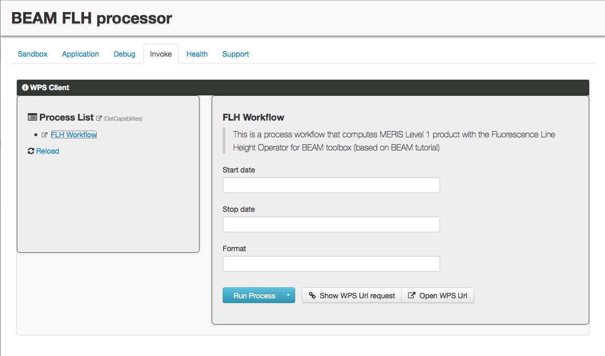

Application exploitation
========================

Using the OGC WPS interface
+++++++++++++++++++++++++++

During the application testing and integration, you used ciop-simjob and ciop-simwf to test the correct execution of the application.

The application can also be invoked using the Open Geospatial Consortium (OGC) Web Processing Service (WPS). 

The Sandbox exposes the OGC WPS GetCapabilities document at the address:

http://localhost:8080/wps/WebProcessingService?service=wps&version=1.0.0&request=getCapabilities

The Sandbox WPS service exposes a single process. Its WPS description document is accessed at the URL:

http://localhost:8080/wps/WebProcessingService?service=wps&version=1.0.0&request=DescribeProcess&identifier=com.terradue.wps_oozie.process.OozieAbstractAlgorithm

The Execute WPS request can be submitted using the URL: 

http://localhost:8080/wps/WebProcessingService?service=wps&version=1.0.0&request=Execute&identifier=com.terradue.wps_oozie.process.OozieAbstractAlgorithm&dataInputs=startdate=2012-04-05;enddate=2012-04-05T23%3A59%3A59;format=GeoTIFF;&ResponseDocument=result_distribution&storeExecuteResponse=true&status=true

The Sandbox dashboard provides a simple WPS client that eases filing the process parameter values and allows submiting the processing task, monitor its progress and finally access the generated products.

  Sandbox dashboard *Invoke* tab showing the WPS client 
  
Try it out by by filling the parameter values:

========== ===================
Parameter  Value
========== ===================
Start date 2012-04-05T00:00:00
Stop date  2012-04-05T23:59:59
Format     GeoTIFF
========== ===================

And click |run_process_button| to submit the processing. Monitor its progress.

Once completed, the dashboard *Invoke* tab will look like:

Feel free to download the GeoTIFF FLH products generated.

Exploiting the application as a Cloud appliance
+++++++++++++++++++++++++++++++++++++++++++++++

Once the application development is over and the application behaves as expected, the Sandbox can be converted to an Appliance and be part of a marketplace.

As an appliance, it can be deployed on a Cloud infrastructure as a computing cluster with several computing nodes and thus processing larger amounts of data in parallel.
