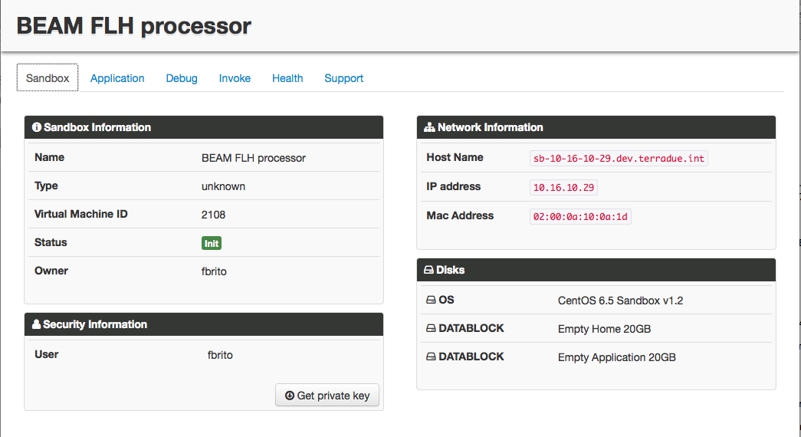
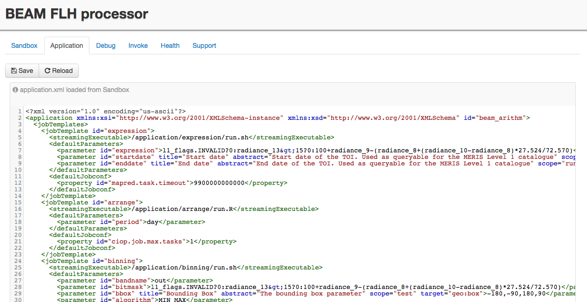
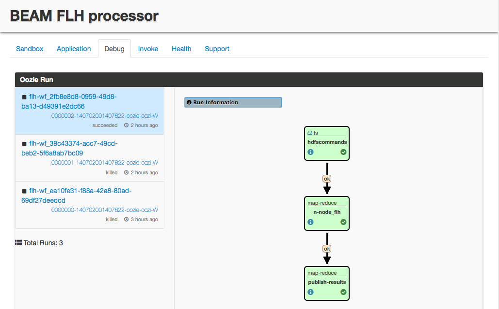
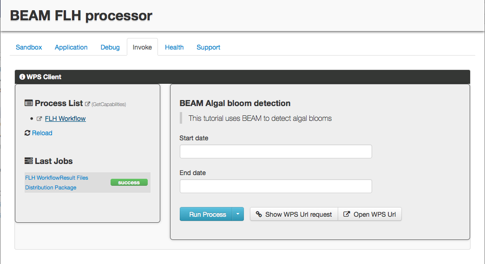
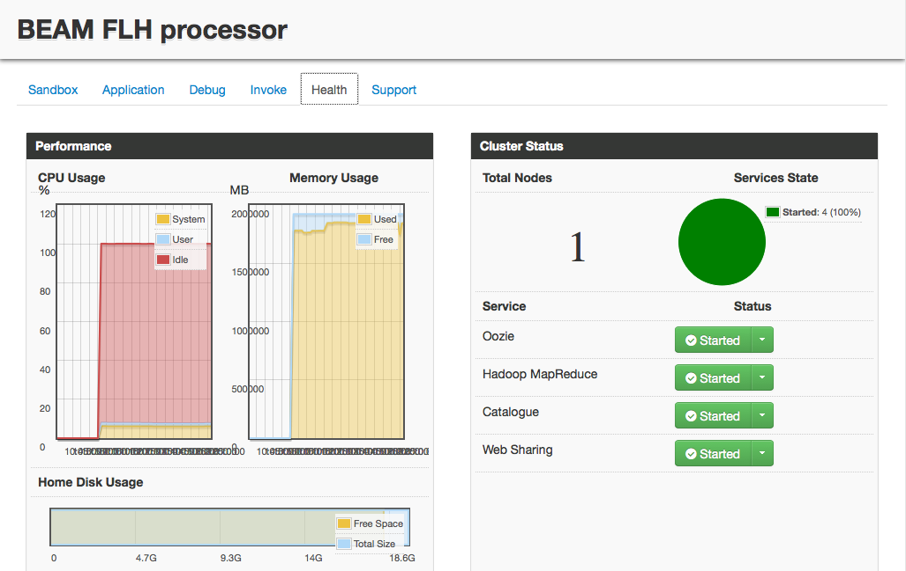
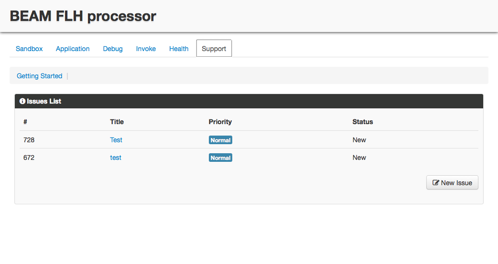
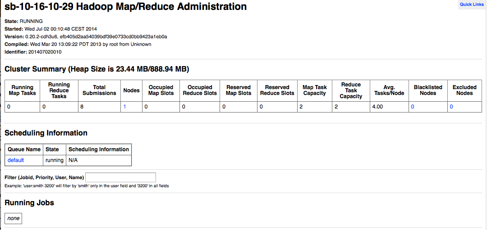
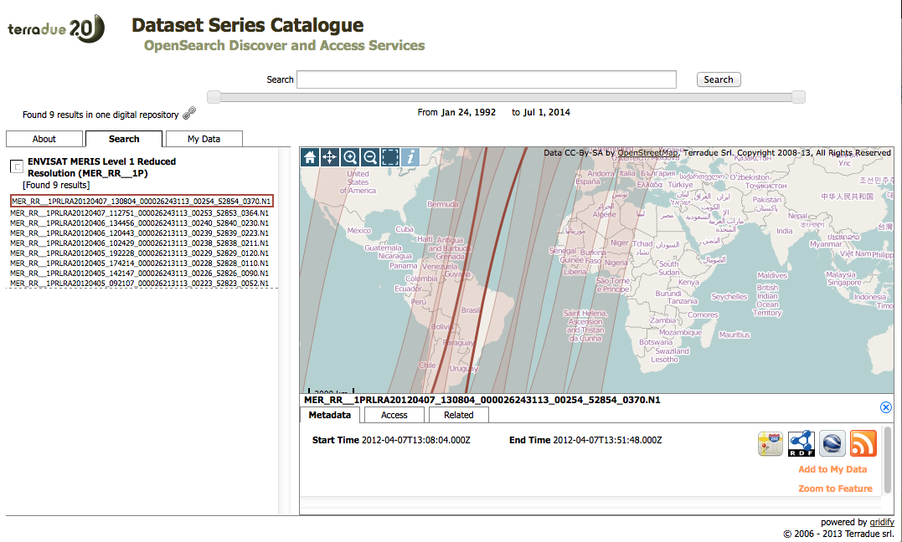

.. _discover:

Discover the Sandbox services & tools
#####################################

User dashboard Web UI
+++++++++++++++++++++

Accessed from the VPN at the address: http://<your_sandbox_host>/dashboard 

The Dashboard provides:

**Sandbox tab**

  The Sandbox status information (name, owner, security, network, disks)

**Application descriptor viewer tab**

  A viewer for the Application Descriptor XML file

**Debug tab**

  A debug tab presenting the workflows launched with the command ciop-simwf or submitted using the WPS interface, as managed by Hadoop Oozie

**Invoke tab**

  
  A processing invocation client, interacting with Hadoop via a Web Processing Service (WPS) interface

**Health tab**

  A Cloud Service health monitoring (CPU consumption, Disk usage, Cluster status)

**Help tab**

  A Ticketing system client to interact with the Platform Support team
 
Job Tracker Web GUI
+++++++++++++++++++

To view processes launched with the ciop-simjob command you can use the Hadoop Job Tracker.

  Accessed from the VPN at the address: http://<your_sandbox_host>:50030/jobtracker.jsp

Data Catalogues
+++++++++++++++

Accessed from the VPN:

* sandbox catalogue http://<your_sandbox_host>/catalogue/sandbox

  
  Sandbox catalogue web interface showing MERIS Level 1 data

The ciop tools
++++++++++++++

The CIOP tools are part of your PaaS development environment.
They form a set of API to manage the data flows (stage-in/out) and are accessed from within the Streaming executable scripts declared in your job templates.

Check the :doc:`Reference Guide <../reference/index>` for a detailed information about the tools.
